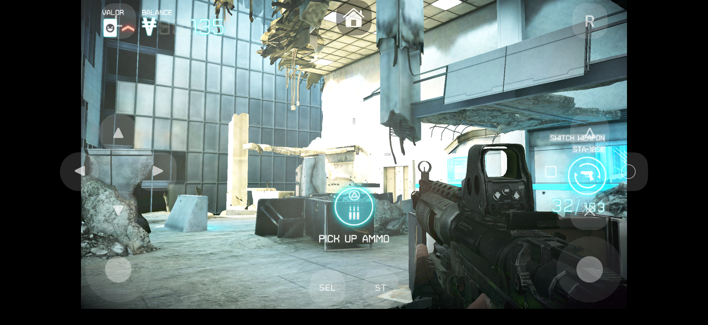
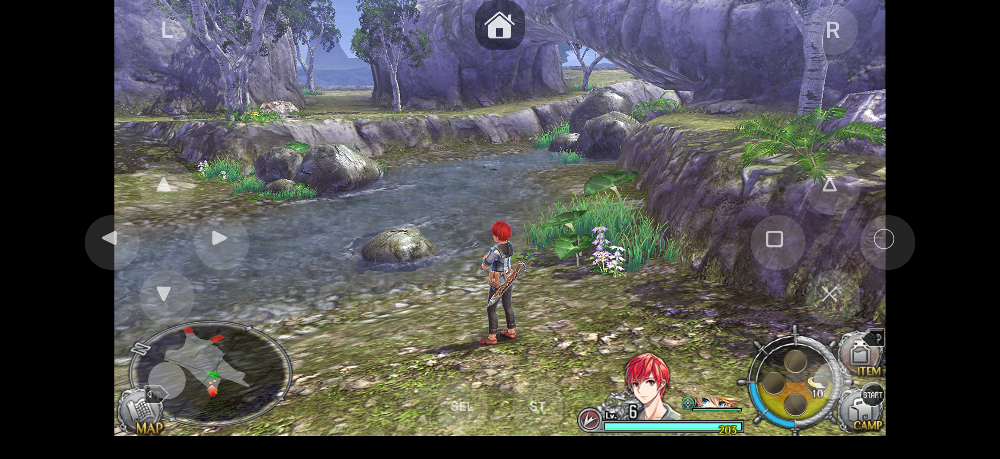
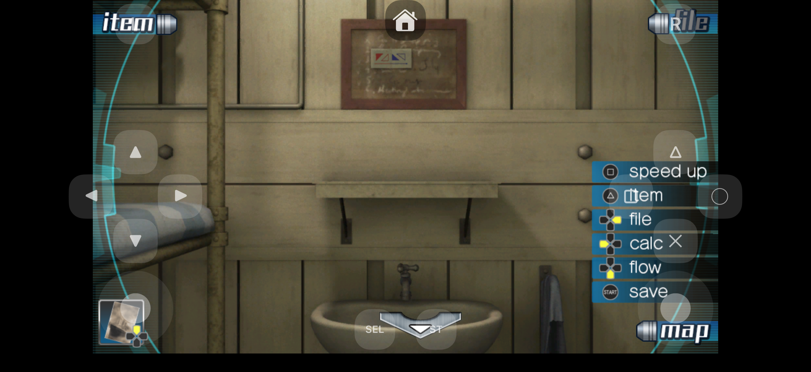
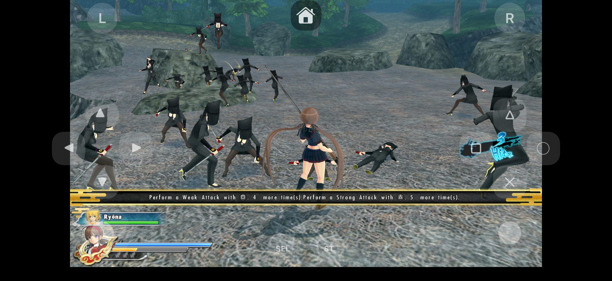

# Veeb

> **Vita is for Weebs.**

**Veeb** is an experimental PlayStation Vita emulator built specifically for **iOS 16.4 and newer**.

The project is focused on bringing Vita emulation to modern Apple devices while providing an iOS-native experience, including controller support, iCloud save synchronization, and JIT execution through **StikDebug**.

> [!WARNING]
> Veeb is highly experimental. Compatibility, performance, and stability may vary significantly between games and iOS versions.

---

## Features

- **iOS 16.4+ support**
- Tested on **iPhone 17 Pro**
- **JIT support through StikDebug**
- **iCloud synchronization for save data**
- Support for **physical game controllers**
- iOS-focused interface and platform integrations
- Game-specific compatibility fixes when necessary
- Based on the mature Vita3K emulator core

---

## JIT and StikDebug

PlayStation Vita emulation requires significantly more processing power than a traditional interpreter can reasonably provide on mobile devices.

Veeb uses **StikDebug** to enable **JIT (Just-In-Time) compilation** on supported iOS devices.

JIT allows the emulator to dynamically compile guest code into native ARM64 code, providing substantially better performance than interpreter-only execution.

Veeb does **not** attempt to bypass the iOS security model by itself. JIT availability depends on StikDebug and the environment used to launch Veeb.

Please refer to the StikDebug project documentation for installation, pairing, and JIT activation instructions.

---

## Screenshots

| | |
|:---:|:---:|
| **Killzone: Mercenary** | **Ys VIII: Lacrimosa of DANA** |
|  |  |
|  |  |

---

## Vita3K

Veeb is a **fork of [Vita3K](https://vita3k.org/)**.

The overwhelming majority of the difficult work required to understand and emulate the PlayStation Vita hardware and operating system was done by the original Vita3K developers and contributors.

Veeb would not exist without their years of research, reverse engineering, development, testing, and maintenance.

A huge thank you to the entire **Vita3K team and community** for making an open-source PlayStation Vita emulator possible.

The purpose of Veeb is not to replace Vita3K, but to adapt and experiment with its emulator core specifically for modern iOS devices.

---

## Compatibility

Veeb currently targets:

- **iOS 16.4 or newer**
- ARM64 Apple devices
- JIT execution through StikDebug

Primary development and testing is currently performed using an **iPhone 17 Pro**.

Support for a device or iOS version does not imply that every Vita game will work correctly. Individual games may have rendering problems, performance issues, crashes, missing functionality, or emulator-specific compatibility requirements.

---

## Contributing

Contributions are welcome.

Bug fixes, performance improvements, iOS integrations, UI improvements, compatibility fixes, documentation, and emulator-core improvements are all appreciated.

### AI-Assisted Contributions

The use of **AI-assisted development tools is acceptable**.

However, contributors are responsible for the code they submit.

AI-generated or AI-assisted code must be:

- Understood by the contributor
- Reviewed before submission
- Tested on actual supported configurations
- Consistent with the existing architecture
- Maintainable by developers without depending on the original AI conversation

Pull requests containing large amounts of unreviewed or untested AI-generated code may be rejected.

### Compatibility Must Not Regress

Contributions that fix one feature or game by **breaking existing compatibility elsewhere will not be accepted**.

Changes to shared emulator behavior should be evaluated against multiple games whenever reasonably possible.

If a compatibility change cannot safely apply globally, it should be implemented as a game-specific workaround instead.

### Game-Specific Hacks

Game-specific hacks and compatibility workarounds **are acceptable** when they are necessary to make a title function correctly.

However, they must be explicitly scoped to the affected game.

For example, a workaround should be associated with the relevant game's Title ID.

A hack required by one game must **not silently alter behavior for any other game**.

Whenever possible, include a comment explaining:

1. Which game requires the workaround
2. Why the workaround is necessary
3. What behavior it changes
4. Whether a proper emulator-level solution may eventually replace it

The objective is to improve compatibility without turning global emulator behavior into a collection of uncontrolled special cases.

---

## Experimental Project

Veeb is an experimental project.

Expect:

- Bugs
- Crashes
- Graphical issues
- Performance problems
- Broken games
- Changes between builds
- Incomplete features

Bug reports and reproducible test cases are especially valuable.

---

## Legal

Veeb does **not** include PlayStation Vita firmware, system files, encryption keys, commercial games, or other copyrighted Sony software.

Users are responsible for obtaining any required firmware, system files, games, and related content from hardware or software they legally own and in accordance with applicable laws.

PlayStation and PlayStation Vita are trademarks of Sony Interactive Entertainment.

Veeb is not affiliated with or endorsed by Sony Interactive Entertainment.

---

## Credits

Special thanks to:

- **Vita3K developers and contributors** — for creating the emulator Veeb is based on and for the enormous amount of reverse-engineering work behind Vita emulation.
- **Vita3K Plus developers and contributors** — for additional compatibility work and fixes for specific games.
- **StikDebug developers and contributors** — for enabling the JIT workflow used by Veeb on iOS.
- Everyone testing Vita games, submitting bug reports, investigating regressions, and contributing improvements to the Vita emulation community.

---

## License

Veeb is derived from Vita3K and must comply with the licensing requirements of the upstream Vita3K project and any other incorporated open-source components.

See the repository's `LICENSE` file for the applicable license and copyright information.
