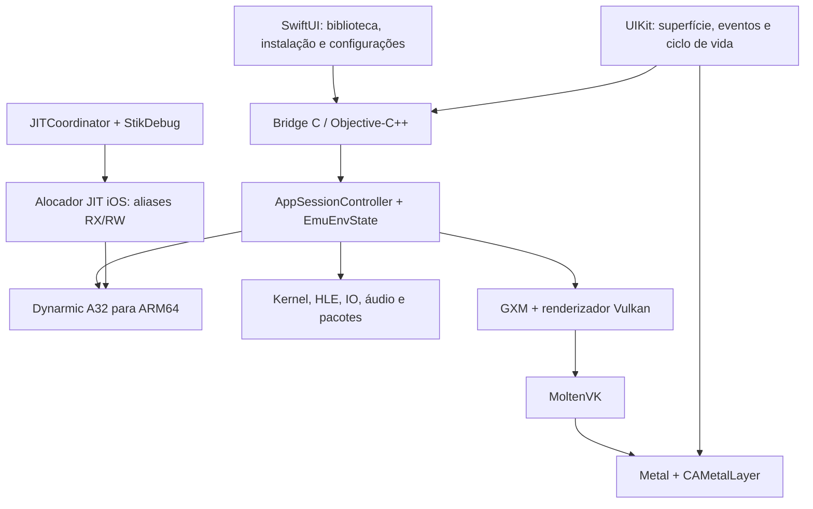

Plano de port do Vita3K para iOS 26+, iPhone 17+ — somente JIT
================================================================

A proposta é preservar o núcleo C++ do Vita3K, adaptar o Dynarmic ao JIT ativado pelo StikDebug, usar Vulkan sobre MoltenVK e criar um frontend SwiftUI/UIKit. A distribuição inicial será por instalação de desenvolvimento/sideload com assinatura compatível. Interpretador está fora do escopo solicitado.

Esta é uma análise estática transversal: inventário da árvore, grafo de build, dependências, buscas de APIs de plataforma e leitura dos caminhos críticos. Foram identificados 763 arquivos C/C++/Objective-C++ em `vita3k/`, com 174.435 linhas incluindo comentários. Isso não representa uma revisão linha a linha de cada implementação HLE. Os 28 submódulos estão sem checkout local; consultei remotamente os arquivos críticos de Dynarmic e FFmpeg nos SHAs fixados pelo projeto. 

**Decisões propostas**

| Item | Decisão inicial | Motivo |
| --- | --- | --- |
| Sistema | Deployment target iOS 26.0; validar cada versão suportada | “26 ou superior” é uma meta de manutenção, não garantia sobre versões futuras |
| Hardware | iPhone 17 base como referência mínima; depois Pro/Pro Max e sucessores | Validar somente no Pro não demonstra suporte ao modelo base |
| Arquitetura | `arm64` | O Vita fornece código ARMv7/Thumb; continua precisando de tradução para AArch64 |
| CPU | Dynarmic A32 → ARM64, JIT obrigatório | Já é a implementação efetiva do projeto |
| Ativação JIT | Validado e testado com o ios/JITProfile (usar este app como referencia) |
| GPU | Backend Vulkan existente + MoltenVK para iOS | Aproveita renderizador, tradutor USSE e suporte Apple existentes |
| Interface | SwiftUI para biblioteca/configuração; UIKit para superfície e eventos | Integração direta com arquivos, ciclo de vida e entrada no iOS |
| Integração com core | Fachada C/Objective-C++ pequena sobre `AppSessionController` | Preserva propriedade dos objetos C++ e evita espalhar APIs Apple pelo núcleo |
| Áudio e gamepads | Começar reaproveitando SDL3 | Ambos já estão integrados no núcleo |
| Resolução | 1×, 960×544, com proporção preservada | Referência inicial para medir correção, custo e temperatura |
| Distribuição | Build de desenvolvimento/IPA para assinatura compatível | `get-task-allow` precisa estar efetivo no aplicativo instalado |

O iPhone 17 base usa A19 com GPU de cinco núcleos. Isso define um alvo promissor, mas não permite prever FPS sem executar os jogos. Os modelos Pro precisam de resultados próprios, sobretudo em sessões prolongadas. [Especificações da Apple](https://www.apple.com/iphone-17/specs/).

**O que o repositório já oferece e o que precisa mudar**

| Área | Evidência no projeto | Consequência para o port |
| --- | --- | --- |
| Build principal | [CMakeLists.txt](../CMakeLists.txt): C++23, deployment macOS 13.3, Boost com comandos próprios | Separar host de destino e macOS de iOS; revisar cross-compilation antes de `project()` |
| Executável e frontend | [vita3k/CMakeLists.txt](../vita3k/CMakeLists.txt), [main.cpp](../vita3k/main.cpp): `QApplication`, Qt incluído para todo `NOT ANDROID` | Criar seleção explícita de frontend e target iOS; retirar Qt do grafo iOS |
| Sessões | [session_controller.h](../vita3k/app/include/app/session_controller.h) e [session_controller.cpp](../vita3k/app/src/session_controller.cpp) | Reaproveitar lançamento, inicialização, pausa por motivo e encerramento |
| Referência mobile | [native_bootstrap.cpp](../vita3k/android/jni/native_bootstrap.cpp), [native_session.cpp](../vita3k/android/jni/native_session.cpp), [main_android.cpp](../vita3k/android/jni/main_android.cpp) | Reaproveitar a sequência lógica; implementar bridge próprio sem JNI |
| CPU | [cpu.cpp](../vita3k/cpu/src/cpu.cpp), [dynarmic_cpu.cpp](../vita3k/cpu/src/dynarmic_cpu.cpp) | `init_cpu()` sempre cria `DynarmicCPU`; `InterpreterFallback()` apenas registra erro |
| Threads | [thread.cpp](../vita3k/kernel/src/thread.cpp) | Cada `ThreadState` inicializa uma CPU; alocações JIT surgem também depois do boot |
| Memória | [mem.cpp](../vita3k/mem/src/mem.cpp), [ptr.h](../vita3k/mem/include/mem/ptr.h) | Reserva contígua de 4 GiB, páginas guest de 4 KiB, proteção e ponteiros base+offset |
| GPU | [renderer.cpp](../vita3k/renderer/src/vulkan/renderer.cpp) | MoltenVK já tem tratamento Apple; mapeamento direto de memória GPU está explicitamente desativado em Apple |
| Superfície | [frame_host.h](../vita3k/renderer/include/renderer/frame_host.h), [screen_renderer.cpp](../vita3k/renderer/src/vulkan/screen_renderer.cpp), [metal_layer.mm](../vita3k/renderer/src/vulkan/metal_layer.mm) | Há `MacOSDisplayHandle`/`NSView`, mas nenhum handle iOS; substituir a dependência Cocoa no novo destino |
| Shaders e GXM | [spirv_recompiler.cpp](../vita3k/shader/src/spirv_recompiler.cpp), `gxm/`, `renderer/` | Preservar tradução USSE → SPIR-V e validar o resultado pelo MoltenVK |
| OpenGL | [renderer/CMakeLists.txt](../vita3k/renderer/CMakeLists.txt), `glutil/`, `external/glad/` | Backend continua compilado apesar da seleção Vulkan em Apple; torná-lo opcional no build iOS |
| Caminhos e configuração | [app_init.cpp](../vita3k/app/src/app_init.cpp), `config/`, `io/`, `util/fs.h` | Ramo Apple assume bundle e diretórios de Mac; injetar `Root` com diretórios do sandbox |
| Conteúdo | `packages/`, `app/`, `io/`, `external/psvpfstools`, `libfat16` | Preservar parsers/instalação e adicionar document picker, progresso e staging no sandbox |
| Áudio/vídeo | `audio/`, `codec/`, `ngs/` | SDL e Cubeb já existem; validar SDL primeiro, FFmpeg/ATRAC9 e sincronização |
| Entrada | `ctrl/`, `input/`, `touch/`, `motion/`, `camera/` | Adaptar eventos de tela, sensores, câmera e permissões; há condicionais mobile exclusivas de Android |
| Diálogos | `dialog/`, `ime/`, `overlay/`, `modules/SceIme/`, `modules/SceCommonDialog/` | Overlays são reutilizáveis; o acionamento de teclado nativo ainda exige integração iOS |
| Rede | `net/`, `http/`, `np/`, `modules/SceNet/` | Sockets/TLS reutilizáveis; `macos_net_helper.cpp` usa `SCDynamicStore` e pressupõe interfaces de Mac |
| Núcleo HLE | `kernel/`, `module/`, `modules/`, `nids/`, `regmgr/`, `rtc/`, `patch/` | Preservar sem reescrever; testar ABI guest, callbacks, sincronização e patches |
| Serviços comuns | `emuenv/`, `display/`, `features/`, `threads/`, `util/`, `lang/`, `compat/` | Reutilizar; revisar fontes de relógio, eventos, caminhos e recursos empacotados |
| Ferramentas e distribuição | `updater/`, `gdbstub/`, `tools/`, `.ci/`, `.github/workflows/`, `dist/`, `data/`, `i18n/` | Separar ferramentas do host; adicionar CI iOS, assets e assinatura; manter traduções nativas separadas das Qt |
| Exemplo de JIT funcionando | disponível em `ios/jitprofile/` 
| Aplicativo ARMS2X | disponível em `ARMS2X/`. emulador de PS2 para iOS com Jit pode servir como inspiração/refêrencia para parte de Jit
| StikDebug | disponível em `StikDebug`. Metodo para acionamento do Jit no iOS 27+. Ja implementando no JitProfile.

O núcleo usa bibliotecas estáticas por subsistema; não precisamos transformar toda a implementação em Swift. A fronteira mais útil já existe entre o ambiente emulado, o controlador de sessão e a superfície de apresentação.

O submódulo Dynarmic fixado pelo Vita3K é `86458a0bd369d63ba4c2ef812cacbb6c9080c065`. A leitura dessa revisão revelou:

- `AddressSpace` usa `oaknut::CodeBlock` e inicializa o gerador com o mesmo endereço para escrita e execução.
- Existe `DualCodeBlock`, verifique se podemos utilizar algo similar ao feito no JitProfile
- O cache padrão A32 é 128 MiB por instância; o backend ARM64 limita a instância a até 128 MiB. Isso requer orçamento próprio para o conjunto de threads.
- O ramo Apple do CMake seleciona tratamento Mach de exceções e geração por `mig` quando encontra os headers. Precisamos verificar SDK e convivência com os handlers de memória do Vita3K.

Fontes fixadas: [AddressSpace](https://github.com/Vita3K/dynarmic/blob/86458a0bd369d63ba4c2ef812cacbb6c9080c065/src/dynarmic/backend/arm64/address_space.cpp), [CodeBlock](https://github.com/Vita3K/dynarmic/blob/86458a0bd369d63ba4c2ef812cacbb6c9080c065/externals/oaknut/include/oaknut/code_block.hpp), [DualCodeBlock](https://github.com/Vita3K/dynarmic/blob/86458a0bd369d63ba4c2ef812cacbb6c9080c065/externals/oaknut/include/oaknut/dual_code_block.hpp), [configuração A32](https://github.com/Vita3K/dynarmic/blob/86458a0bd369d63ba4c2ef812cacbb6c9080c065/src/dynarmic/interface/A32/config.h), [CMake do backend](https://github.com/Vita3K/dynarmic/blob/86458a0bd369d63ba4c2ef812cacbb6c9080c065/src/dynarmic/CMakeLists.txt).

A solução de engenharia proposta é um alocador iOS de regiões JIT com endereços RX e RW distintos, integrado por uma interface pequena ao Dynarmic. Os detalhes de remapeamento precisam ser comprovados no aparelho. Não basta retornar um ponteiro executável: emissão, relocação, ligação de blocos, invalidação, trampolins e recuperação de falhas precisam usar o endereço correto.

Esse alocador terá uma reserva compartilhada no processo, previamente preparada, da qual cada instância Dynarmic recebe uma fatia privada. Compartilhar a reserva não significa compartilhar o estado da CPU nem o conteúdo dos caches entre threads. O controlador precisa devolver fatias somente depois que nenhuma execução ou callback puder referenciá-las. O tamanho da reserva e das fatias será escolhido por medição; testar inicialmente caches por instância de 8/16/32 MiB, mantendo o limite exigido pelo backend e uma política explícita para esgotamento.

**Arquitetura proposta**



SwiftUI não deve possuir os objetos internos do emulador. A fachada expõe operações como inicializar, listar/importar conteúdo, iniciar, pausar, encerrar e consultar progresso/erro. O C++ mantém o ambiente e seus tempos de vida. Chamadas demoradas usam uma fila de trabalho; UIKit permanece na thread principal. O renderizador continua com sua thread própria.

Recomendo um `IOSDisplayHandle` que forneça a `CAMetalLayer` já criada pelo UIKit, com regras explícitas de retenção. Assim o backend não precisa converter um objeto `UIView` em `NSView`. A classe `IOSFrameHost` fornece tamanho em pixels e diretórios de fontes, além de coordenar destruição da superfície.

MoltenVK suporta iOS por XCFramework e converte SPIR-V para MSL. Podemos manter esse caminho, usando a superfície `VK_EXT_metal_surface`. As extensões e formatos efetivamente disponíveis precisam ser consultados no dispositivo. [Guia oficial MoltenVK](https://github.com/KhronosGroup/MoltenVK/blob/main/Docs/MoltenVK_Runtime_UserGuide.md).

**Plano de execução, em ordem**

1. **Fixar a referência e preparar a bancada.** - FEITO COM SUCESSO
2. **Construir uma prova isolada de JIT com StikDebug.** - FEITO COM SUCESSO - JitProfile em ios/jitprofile
3. **Adaptar Dynarmic/Oaknut e o orçamento dos caches.**

    **STATUS (2026-09-24) — ETAPA 3 CONCLUÍDA ✅:** `JitMemory` (arena
    dual-map RX/RW, `brk #0xf00d`, slices, keep-alive, shutdown) validada em
    `ios/JitDynTest`: **simulador iPhone 17/iOS 26.5 = 7/7 PASS**; **device
    iPhone 17 Pro = negativo PASS** (sem StikDebug, falha limpa) e
    **positivo 7/7 PASS via StikDebug** (execução RW→RX, self-modificação e
    slices em hardware real). Achado de protocolo registrado: o StikDebug
    atende **um ciclo PrepareRegion/Detach por sessão** — a arena é por
    processo (prepare no launch; recuperação = relançar via StikDebug).
    Pendência opcional (adiada): suite A32/Thumb do Dynarmic cross-compilada
    p/ target iOS (já validada no host; ver `ios/JitDynTest/AGENTS.md`).

   Introduzir a interface de alocação JIT iOS no fork fixado de Dynarmic. Preservar os caminhos existentes nas demais plataformas. Integrar a reserva preparada e as fatias por instância, com limpeza correta, erros propagados e sincronização ao reutilizar memória.

   Revisar todos os locais que assumem `mem.ptr()` único: gerador, leitura de código, relocations, patching de branches, ligação/desligamento de blocos e mapas usados por exceções. As instruções geradas devem usar PCs RX para calcular saltos; alterações de bytes devem atingir RW. Validar invalidação de cache, alinhamento, ABI Apple ARM64, preservação de registradores reservados e limites de alcance de branches.

   Integrar orçamento/configuração a `DynarmicCPU::make_jit()`. Medir a memória após a preparação pelo debugger, porque reservar endereços e preparar páginas podem ter custos diferentes. A criação tardia de `ThreadState`, as recriações por logging e o encerramento/reabertura de jogos devem reutilizar a reserva do processo.

   Começar o diagnóstico com callbacks de acesso à memória, mantendo o Dynarmic como executor. Isso continua sendo JIT: desligar fastmem não seleciona um interpretador. Habilitar fastmem somente depois de testar o tratamento de falhas, a coerência CPU/GPU e sua interação com Mach/signals.

   **Entrega:** testes A32/Thumb executados pelo Dynarmic dentro do app. **Aceite:** operações inteiras, flags, VFP/NEON, SVC, TLS/CP15, atomics/exclusives, callbacks HLE, invalidação e criação/destruição de threads; falha controlada em caso de cache esgotado. Repetir testes depois que o StikDebug se desconectar.

4. **Portar build e dependências para iOS.**

   Adicionar detecção explícita de iOS, seleção de frontend e presets separados para device/simulator. Aplicar `CMAKE_SYSTEM_NAME=iOS`, `CMAKE_OSX_SYSROOT=iphoneos`, `CMAKE_OSX_ARCHITECTURES=arm64` e deployment 26.0 no ponto correto da configuração; impedir que o valor macOS 13.3 os sobrescreva. Habilitar Objective-C++ para os adapters. A mecânica de cross-compilation deve seguir a documentação do CMake. [Toolchains CMake](https://cmake.org/cmake/help/latest/manual/cmake-toolchains.7.html#cross-compiling-for-ios-tvos-visionos-or-watchos).

   Criar um target de integração do core, ligado às bibliotecas existentes, e um app Xcode que o consuma. A organização exata entre projeto Xcode e geração CMake deve ser fixada aqui e reproduzida no CI. Usar diretórios de build e artefatos distintos para SDKs distintos, mesmo quando ambos forem ARM64.

   Converter os condicionais `NOT ANDROID` em escolhas explícitas nos pontos de frontend, traduções, testes e ferramentas. Para iOS, desabilitar Qt, Discord, updater desktop, drivers Android e backend OpenGL. Isso inclui remover fontes/links e condicionar factories e chamadas aos símbolos desses backends. Uma opção visual escondida não elimina dependências de link.

   Separar `BUILD_TESTING`/ferramentas de host dos artefatos destinados ao aparelho. Não tentar executar um binário iOS gerado durante o configure do host. Revisar também a geração `mig` do Dynarmic e o target `tools/gen-modules`.

   **Entrega:** app mínimo que liga o core e carrega seus recursos. **Aceite:** build limpo em Mac, bibliotecas com plataforma iOS correta e inicialização no aparelho sem dependências Qt/Cocoa/macOS.

   **Status (entrega parcial):** toolchains `cmake/ios-device.cmake`/`ios-simulator.cmake` (sysroot
   `iphoneos`/`iphonesimulator`, arm64, deployment 26.0, OBJCXX; Python 3.12+ do host resolvido no
   toolchain para os code-generators). Presets `ios-device`/`ios-simulator` em `CMakePresets.json`.
   Excluído do grafo iOS: Qt/gui, Discord, NFD, cubeb (áudio via backend SDL), OpenGL (metal_layer),
   testes de host e `tools/gen-modules`. OpenSSL cross-estático via targets `ios64-xcrun`/
   `iossimulator-arm64-xcrun` (verificação de plataforma IOS nos objetos; `make build_libs` para
   evitar o syslog ausente no iOS). FFmpeg: pré-builds do fork Vita3K (device e simulator); o
   seletor do fork é case-sensitive no sysroot e baixa o zip de device em builds de simulator,
   corrigido no CMake raiz sem tocar no submódulo. MoltenVK v1.4.1: apenas slice `ios-arm64`
   (estático) — o simulador liga o core sem Vulkan até existir slice de simulador. Boost:
   `boost_filesystem` compilado do `external/boost` (b2 não faz cross p/ iOS). Target de
   integração: `Vita3KCore` (dylib arm64, `@rpath`, `-undefined dynamic_lookup` para os símbolos
   Vulkan) + bridge C (`vita3k_ios_version`/`self_test`/`jit_report`) em `vita3k/ios`. App shell
   SwiftUI em `ios/Vita3K` (XcodeGen, dois sabores: `project.yml` device e `project-sim.yml`
   simulator; staging via `ios/Vita3K/scripts/stage-core.sh`). CI: `.ci/build-ios.sh` +
   `.github/workflows/ios.yml`.

   **Validado:** builds completos e limpos de device e simulator no Mac (Xcode 27, SDK iOS 27.0);
   dylibs com `platform IOS`/`IOSSIMULATOR`, minos 26.0; **smoke test no simulador iPhone 17:
   self-test do core PASS** (rc=0, version `0.2.1-4099`, page_size 16384, logging OK com arquivo
   real) e **validado no iPhone 17 Pro físico** (self-test PASS, rc=0, page_size 16384,
   `vita3k.log` gravado no sandbox). Achado importante: no device, o dylib aninhado precisa ser
   assinado ANTES da fase Code Sign do bundle (script pre-build copia + assina com a identidade
   de desenvolvedor); sem isso o dyld rejeita o load e o app morre antes de `main()` com tela
   branca e exit 0 (o simulator não exige). `jit_arena: not prepared` no self-test é esperado
   nesta etapa: a preparação da arena acontece no boot da CPU emulada (etapas seguintes).
   **Pendente:** a inicialização completa em aparelho (etapa 5).

5. **Validar o modelo de memória do Vita3K.**

   Executar `mem::init` em aparelho com a assinatura real. Medir sucesso da reserva contígua de 4 GiB, tamanho de página do host, footprint físico, orçamento restante e comportamento sob pressão. A reserva virtual de 4 GiB não significa consumir 4 GiB de RAM imediatamente. Os caches JIT e recursos gráficos precisam entrar no orçamento total.

   Avaliar `com.apple.developer.kernel.extended-virtual-addressing` no perfil de assinatura. Avaliar separadamente `com.apple.developer.kernel.increased-memory-limit`, sem pressupor que estará disponível ou que eliminará o limite do processo. A documentação da Apple distingue espaço de endereçamento e memória adicional em modelos suportados. [Extended Virtual Addressing](https://developer.apple.com/help/glossary/#extended-virtual-addressing), [Increased Memory Limit](https://developer.apple.com/documentation/bundleresources/entitlements/com.apple.developer.kernel.increased-memory-limit).

   Testar guest pages de 4 KiB sobre páginas maiores do host, incluindo duas alocações guest na mesma página física, liberação parcial, proteção de texturas e guard pages. O código já consulta o tamanho real da página; precisamos verificar o conjunto de operações, não apenas trocar uma constante.

   **Ponto de decisão:** a `page_table` atual também é inicializada sobre a reserva de 4 GiB. Ela não é um fallback de memória esparsa pronto. Se a reserva falhar de forma persistente, será necessário um projeto adicional envolvendo `MemState`, `Ptr<T>`, conversões reversas de ponteiros, acesso direto a `mem.memory`, buffers contíguos e caches do renderer. Reestimar antes de seguir por essa alternativa.

   **Entrega:** relatório de limites e configuração suportada. **Aceite:** alocar/liberar, tratar violações esperadas e repetir sessões sem crescimento contínuo de footprint; falhas de alocação devem retornar erro ao frontend.

   **STATUS (2026-09-25) — ETAPA 5 CONCLUÍDA ✅:**
   `vita3k_ios_memory_test` (em `vita3k/ios/src/memory_test.cpp`, botão "Memory test"
   + "Poll StikDebug + test" no app, auto-roda no launch em background) valida
   o modelo de memória no target usando os caminhos de produção (`mem::init/
   alloc/free/protect`, handler SIGBUS/SIGSEGV, `vita::ios::JitMemory`):

   - **Simulador iPhone 17 (iOS 26.5): 12/12 PASS (rc=0)** — reserva 4 GiB
     (`base=0x7000000000`, hint `1<<34` realocada pelo kernel); guest 4 KiB
     sobre host 16 KiB: `a1=0x80000000`/`a2=0x80001000` no MESMO host page,
     write/read OK; `free(a1)` com `a2` vivo mantém o host page commited;
     `a3` reutiliza a página liberada; modo `use_page_table=true` (tabela de
     8 MiB sobre a reserva) com protect/fault OK; semântica de sibling
     (proteger 4 KiB cobre o host page 16 KiB até a fault, que devolve os 16
     KiB e o vizinho segue íntegro); pressão 100×{64 KiB alloc/write/free}:
     delta footprint 3 MiB; arena dual-map 32 MiB preparada; **bootstrap JIT
     OK** (código emitido no alias RW, flush `dc civac`/`ic ivau`/`dsb ish`/
     `isb`, executado pela vista RX: `f(1,*g=41)=42`, store `*g=77`,
     self-mod 5→7, `guest=0x80000000`); slices (first-fit exact + split 32
     KiB) + `validate_alive` OK.
   - **Device iPhone 17 Pro (iOS 26.7, 12 GB): rc=0 PASS** — reserva 4 GiB OK
     (`base=0x300000000`, hint relocada); guest pages, partial free e reuse
     OK; pressão 100×64 KiB: delta 1–3 MiB; **bootstrap JIT validado em
     hardware real via StikDebug** (arena dual-map preparada pelo protocolo
     `brk #0xf00d`, código emitido no alias RW executado pela vista RX
     lendo/escrevendo páginas guest da reserva de 4 GiB — confirmado no UI
     do app; rodado sem StikDebug, `E.arena: not prepared` é reportado como
     *skipped* limpo, não falha). Achado de protocolo: o `CS_DEBUGGED` fica
     1 assim que o debugador anexa, mas o script `universal.js` leva alguns
     segundos para armar o handler JIT26 — por isso o prepare usa ~10
     tentativas em ~15 s; e o **pareamento do StikDebug invalida ao
     reinstalar o app** (cdhash muda): re-parear o build atual antes de
     testar.
   - **Limites medidos (device iOS 26.7):** `os_proc_available_memory()` =
     **3 GiB** (orçamento default por app; Apple documenta o "default app
     memory limit" e o entitlement `increased-memory-limit` p/ modelos
     suportados — o valor de ~6 GiB reportado pelo usuário vale p/ iOS 27 e
     deve ser re-medido após o update). O teto de VA com hint de produção
     acomoda o bloco de 4 GiB (o kernel o realoca); um **segundo** reserva de
     4 GiB simultâneo é recusado no device (VA budget) — os modos
     `page_table`/estado extra do teste são validados no simulador; o
     produto usa **um** `MemState` por processo. `EAV`
     (`com.apple.developer.kernel.extended-virtual-addressing`) está no
     bundle, mas sem efeito observável neste perfil/OS (teto de VA
     inalterado) — mantido p/ quando o perfil passar a concedê-lo.
   - **Orçamento (3 GiB) vs uso previsto:** base ~0,5 GiB (footprint
     medido ~50 MiB c/ dylibs) + guest commited (RAM do Vita = 512 MiB →
     tipicamente 0,3–1 GiB; só as páginas RW contam) + GPU 544p
     (0,3–1 GiB) + arena JIT (256 MiB virtuais, alias RX/RW sem duplicação
     física, ~128 MiB tocados) = cabe em 3 GiB; se aperto em títulos pesados
     (etapa 11), pedir `increased-memory-limit` no perfil.

6. **Apresentar Vulkan/MoltenVK em uma tela UIKit.**

   Substituir, para iOS, o download de `MoltenVK-macos.tar` e o empacotamento da `.dylib` por um artefato iOS fixado. Começar com a mesma versão 1.4.1 referenciada pelo projeto, se adequada ao SDK selecionado, e justificar qualquer atualização por resultado de testes. Preferir ligação estática do XCFramework para simplificar descoberta de símbolos.

   Inicializar Vulkan-Hpp com `vkGetInstanceProcAddr` da biblioteca ligada, inclusive na enumeração de GPUs anterior ao renderer; não depender da descoberta de uma biblioteca Vulkan instalada no sistema. Verificar todas as inicializações do dispatcher.

   Implementar `IOSFrameHost`, o handle de camada e a criação de superfície. Controlar `drawableSize`, escala da tela, orientação, safe areas e recriação de swapchain. Escolher formato de cor/corespace explicitamente. A thread de renderização não deve modificar UIKit diretamente.

    Manter inicialmente desativado o mapeamento direto de memória GPU, seguindo o caminho Apple atual. Consultar e registrar extensões, formatos e limites; habilitar apenas capacidades disponíveis. Não confundir esse mapeamento GPU com fastmem da CPU ou com a reserva guest de 4 GiB.

    **Entrega:** cena Vulkan simples no iPhone. **Aceite:** apresentação contínua, redimensionamento e retorno ao app sem surface/device lost não tratado; depois apresentar um quadro produzido por um homebrew Vita.

    **STATUS (2026-09-25) — ETAPA 6 CONCLUÍDA ✅ (simulador + device validados):**
    Caminho de produção reutilizado de ponta a ponta: `IOSFrameHost`
    (renderer::FrameHost sobre `CAMetalLayer` UIKit, estado lock-free
    layer/size) + `VK_EXT_metal_surface` + swapchain no drawableSize em
    pixels + pipeline `BilinearScreenFilter` (mesmos `.spv` de
    `shaders-builtin/vulkan` do macOS → MSL pelo MoltenVK) apresentando um
    test pattern animado 960x544 escrito em memória guest. Dispatcher do
    Vulkan inicializado a partir do `vkGetInstanceProcAddr` do MoltenVK
    ligado estaticamente pelo app (XCFramework v1.4.1, slice `ios-arm64`)
    — no iOS não há loader para dlopen; `renderer.cpp` declara o símbolo e
    o dylib o resolve da imagem do app (`-undefined dynamic_lookup`).
    Frontend: `EmulationSurfaceView` (UIView+CAMetalLayer) +
    `EmulationViewController` (start no appear, stop no resign-active,
    restart no did-become-active, resize via `layoutSubviews` →
    `vita3k_ios_frame_host_set_size`) embutido no SwiftUI
    (`UIViewControllerRepresentable`, fullScreenCover) com relatório ao vivo
    (frames/fps/extent + extensões/formatos/limits consultados do device).
    Bridge: `vita3k_ios_vulkan_demo_start/stop/is_running/report` +
    `vita3k_ios_frame_host_set_layer/set_size`; a `CAMetalLayer` cruza para
    o core pela thread principal (frame-host), nunca como argumento da
    chamada que roda fora do main actor (exigência de region isolation do
    Swift 6.2: ponteiro bruto capturado por closure `sending` = race com o
    estado main-actor).

    - **Simulador iPhone 17 (iOS 26.5/SDK 27): validado** — slice MoltenVK
      não existe para simulador (v1.4.1); o core de simulador define um
      stub local de `vkGetInstanceProcAddr` (retorna null, nunca chamado —
      a demo reporta `rc=-5` antes de tocar em Vulkan). **Achado:** sem o
      stub, o dylib referencia o símbolo via dynamic lookup e o dyld do
      bundle (flat namespace) aborta no launch com "symbol not found in
      flat namespace '_vkGetInstanceProcAddr'" (tela branca, crash report
      DYLD) — corrigido. Smoke: app lança limpo, self-test PASS
      (`0.2.1-4100`, page_size 16384), memory test rc=0, demo desabilitada
      limpa ("demo indisponível (rc=-5)" + aviso no card).
    - **Device iPhone 17 Pro (iOS 26.7): validado ✅** — build device
      instalado e lançado no hardware real: a cena Vulkan/MoltenVK
      apresentou no `CAMetalLayer` do app (test pattern animado +
      relatório completo na UI: GPU, surface format, extensões, limits,
      heaps), sem crash no launch e com os cycles de vida tratados
      (stop no resign-active, restart no did-become-active). Dois
      achados de dyld corrigidos durante a validação:
      (a) **flat namespace no device** — o executável do app não
      arrastava nenhum objeto da libMoltenVK estática (nada no app
      referencia os símbolos Vulkan; só o dylib do core os referencia,
      em runtime via `-undefined dynamic_lookup`) → `dyld: symbol not
      found in flat namespace '_vkGetInstanceProcAddr'` no launch
      (tela branca, exit 0, mesmo padrão do item de assinatura da etapa
      4): corrigido com `-force_load` do archive
      (`MoltenVK.xcframework/ios-arm64/libMoltenVK.a`) no target do app;
      (b) em configuração **Debug** o código real do app vive em
      `Vita3K.debug.dylib` (o executável `Vita3K` é um stub que o
      aliasa) — é nesse dylib que o MoltenVK forçado e o
      `vkGetInstanceProcAddr` exportado ficam visíveis ao dyld do
      bundle. O par no simulador é o stub no dylib do core documentado
      acima.
    - **Restrição de slice (documentada):** MoltenVK v1.4.1 não tem
      slice de simulador; a cena Vulkan existe somente no flavor
      device. Se uma validação de frontend no simulador exigir Vulkan,
      o passo é construir o MoltenVK (ou uma versão posterior) com slice
      `ios-arm64-simulator` — decisão futura, fora do escopo desta
      etapa.

    **Pendente (carregado para a etapa 7):** o quadro de homebrew da
    última frase do aceite — com o boot da sessão a superfície passa a
    apresentar o front buffer emulado no lugar do test pattern (mesmo
    caminho upload/present já validado aqui).

7. **Integrar core, arquivos e primeiro boot.**

   Criar a fachada Objective-C++/C e conectá-la ao controlador de sessões. Injetar `Root` antes de inicializar configurações e IO. Colocar recursos imutáveis no bundle, dados do emulador em Application Support, caches regeneráveis em Caches e importações/exportações numa área definida de Documents. Não persistir como identidade o caminho absoluto do container, que pode mudar.

   Reutilizar listagem, usuários, instaladores e detecção de firmware. Usar document picker com acesso autorizado à URL e copiar para staging dentro do sandbox. Suportar cancelamento e limpeza após erro, verificar espaço livre e fazer operações de leitura/escrita grandes em streaming. Arquivos de games/firmware são fornecidos pelo usuário; os casos distribuídos para validação devem ter licença adequada.

   Primeiro iniciar um homebrew que registre saída; depois um que desenhe e aceite entrada. Só então executar os títulos de referência. Inicializar a CPU emulada apenas quando o JITCoordinator estiver pronto.

    **Entrega:** biblioteca mínima que importa e abre conteúdo. **Aceite:** boot repetível, erros visíveis, encerramento sem deadlock e abertura de outro título no mesmo processo.

    **STATUS (2026-09-26) — ETAPA 7 CONCLUÍDA ✅ (simulador validado: boot repetível, erros visíveis, stop sem deadlock e troca de títulos no mesmo processo, incluindo retail NoNpDRM):**

    **Resultados (etapa 7 — validado no simulador iPhone 17 Pro, iOS 26.5):**

    - **Fachada C/ObjC++** (`vita3k/ios/src/session_ios.cpp`): `session_init` espelha o bootstrap Android (Root sob o sandbox, `logging`, `EmuEnvState`, `config`, `app::init`, listagem de apps, usuários, compat DB); `session_launch` roda `begin_launch → initialize_renderer → initialize_runtime → load_and_run` numa thread própria (a thread principal precisa seguir responsiva); `session_stop`/`report`/`set_pause`/`get_apps`/`scan_apps`/`firmware_mask` completam a API. O `Root` é re-resolvido a cada launch (o caminho absoluto do container nunca é persistido como identidade).
    - **Sandbox/staging**: layout `base/{vita,logs,config,shared,cache,patch,imports}` sob Documents; o document picker copia para `imports/` (security-scoped) e a instalação corre em background.
    - **Instaladores**: conteúdo de app (pasta ou `.zip`/`.vpk` com `eboot.bin`+`sce_sys/param.sfo`, parser ZIP próprio com inflate raw do miniz), `.pkg` (`install_pkg`) e `.pup` (`install_pup`). Instalação em `ux0/app/<TITLE_ID>` para qualquer categoria (retail `gp`, homebrew `gd`, …) — a listagem do core varre todos os diretórios de `ux0/app` independente da categoria.
    - **Firmware**: os três PUPs fornecidos (`PSVUPDAT.PUP`, `PSP2UPDAT.PUP`, `PSP2UPDAT_2.PUP`) instalam `vs0`/`pd0`/`sa0` (+ PSP2) no Vita FS; provisionamento idempotente (marker) no primeiro launch.
    - **MoltenVK no simulador**: o release v1.4.1 não traz slice de simulador; foi construído a partir da fonte (script `ios/Vita3K/scripts/build-moltenvk-sim.sh`: MoltenVK+ShaderConverter+Common+SPIRV-Cross num único `.a`), forçado no app e resolvido pelo dylib do core via dynamic-lookup (mesmo mecanismo do slice do device). O renderer reporta `Vulkan device: Apple iOS simulator GPU`.
    - **Primeiro boot de homebrew no simulador**: `vitahelloworld` (`XERP00001`) boota e executa — logs mostram arena JIT dual-map pronta (`rx`/`rw`), caches JIT por thread (dynarmic), módulos de firmware (`libc`, `libfios2`, …), `App session phase: Launching -> Running` e `Game started: vitahelloworld (XERP00001)`.
    - **Correções aplicadas no caminho**: offsets do EOCD no parser ZIP; gate de categoria `gp`→qualquer; `cfg.vita_fs_path` obsoleto (pinar no Root fresco); `fullScreenCover(item:)` para o representable nunca ver `appPath` obsoleto; `CA_ASSERT_MAIN_THREAD_TRANSACTIONS=0` (o renderer configura a colorspace do `CAMetalLayer` na thread de launch; no Debug do simulador isso aborta, no device/Release é apenas aviso — iguala o comportamento do device); `ARCHS=arm64` fixado no app (o default do Release compila também x86_64, que falha no link das libs arm64); o dylib do core passa a ser embutido em `Frameworks/` (o único rpath garantido do executável — na raiz do bundle o dyld não o resolvia em Release; no Debug o helper `Vita3K.debug.dylib` mascarava o problema); tracy sempre definido como target no CMake (no Release o `-ltracy` cru quebrou o link); e **o bug de lifetime do frame host** (ver abaixo).
    - **Build Release validado no simulador**: com `RelWithDebInfo` (NDEBUG) o jogo roda de forma estável — `vitahelloworld` boota, `Launching -> Running`, e a sessão segue viva com o render loop ativo (MoltenVK no simulador) por minutos, apresentando o padrão do jogo na tela (screenshot `build/external/RELEASE-GAME-RUNNING.png`).
    - **Root cause do crash de Release (corrigido)**: o worker de `vita3k_ios_session_launch` destruíava o `IOSFrameHost` (`s.frame_host.reset()`) logo após o jogo iniciar, mas `renderer::init` armazena `state->frame = &frame_host` e a thread de render o dereferencia a cada quadro (`window_has_drawable_size`, screen_renderer.cpp:65) → use-after-free na primeira frame. O host agora só é descartado no caminho de stop/deinit, **depois** de `controller->stop()` ter juntado a thread de render (o `shutdown_app_runtime` chama `renderer::stop_render_thread` antes do cleanup GPU).
    - **Ponto aberto (core, não do shell)**: em build **Debug** do simulador, o JIT A32 do dynarmic aborta em `BOOST_ASSERT` do `boost::icl::interval_map` (`gap_insert`/`add_rear` ← `A32AddressSpace::RegisterNewBasicBlock`) ao compilar blocos do homebrew. As asserções são desativadas em Release (`NDEBUG`), então o device/Release não aborta; se o estado do interval_map estiver realmente inconsistente, tratar no core (dynarmic).
    - **Títulos retail NoNpDRM no instalador de conteúdo de app** (2026-09-26): zips NoNpDRM usam layout `app/<TITLE_ID>/` (nesting de 2 níveis — `find_app_content_root` desce por diretórios filhos únicos) e levam o klicensee em `sce_sys/package/work.bin`. O instalador de conteúdo de app (cópia crua) agora executa o mesmo `decrypt_install_nonpdrm` (f00d) do caminho PKG sempre que `work.bin` existe — o eboot passa a ser texto puro no disco e o jogo roda sem licença PSN. Detalhe: o `CATEGORY` do param.sfo de alguns NoNpDRM é `gd` (não `gp`), então o disparador é a presença do `work.bin`, não a categoria. Correlato: `AudioState::open_port`/`CubebAudioAdapter::open_port` agora tratam adapter/contexto nulos (`audio.init()` falha no simulador — sem dispositivo de áudio) em vez de crashar no primeiro `sceAudioOutOpenPort` do jogo.
    - **Encerramento, troca de título e stop limpo validados no mesmo processo** (2026-09-26, gatilho CLI `imports/ctl-stop.txt` → `sessionStop` + dismiss da superfície + (opcional) relançamento): `vitahelloworld` → stop → **10 Second Ninja X (PCSE00890, retail NoNpDRM)** roda estável no simulador (minutos, ~40% CPU, frames reais na tela — screenshot `build/external/SNX-RUNNING.png`) → stop → volta ao `vitahelloworld` no mesmo processo → stop puro retorna à biblioteca com o processo vivo (sem deadlock). O `startDemo` da superfície aguarda (limitado a 30s) o teardown da sessão anterior antes de entregar a nova `CAMetalLayer`/lançar. **Aceite da etapa 7 atendido**: boot repetível, erros visíveis (banner + relatório + falhas NoNpDRM/áudio degradando graciosamente), encerramento sem deadlock e abertura de outro título no mesmo processo.

    **Validação adicional em aparelho (2026-09-27) — crash de JIT corrigido:**

    - iPhone 17 Pro / iOS 26.7, build Release assinado com `get-task-allow`, iniciado pelo StikDebug **Universal**. O homebrew `XERP00001` chegou a `Running` e renderizou sua cena (~59 FPS na captura). A troca no mesmo processo para `PCSE00890` (10 Second Ninja X) chegou ao gameplay, com várias threads usando caches de 16 MiB. Isso substitui, para esses dois títulos, a pendência de boot em hardware real; não representa validação prolongada de todos os jogos.
    - **Cache de instruções:** removido o passo fixo de 128 bytes e os modos experimentais de flush. Oaknut publica o alias RW com `sys_dcache_flush` e invalida a vista RX com `sys_icache_invalidate`. O caminho ARM64 não Apple consulta separadamente os tamanhos D/I em `CTR_EL0` e usa `DSB` entre as operações. Referências: [API Darwin](https://developer.apple.com/library/archive/documentation/System/Conceptual/ManPages_iPhoneOS/man3/sys_icache_invalidate.3.html), [sequência ARM](https://developer.arm.com/community/arm-community-blogs/b/architectures-and-processors-blog/posts/caches-self-modifying-code-implementing-clear-cache).
    - **Protocolo e memória:** Universal por padrão, retorno em `x0` verificado (o script Universal rejeita `brk #0x69`; antes, apenas retornar do breakpoint era considerado sucesso). Preparação síncrona na thread de trabalho, sem worker destacado retendo referências da pilha após timeout. Removidas escritas periódicas em bytes do próprio código e as suposições sobre páginas recicladas. `validate_alive` verifica estado sem alterar instruções; `CS_DEBUGGED` não é prova de debugger ainda anexado.
    - **Ciclo de vida e orçamento:** restauração do relink/unlink na invalidação e da reciclagem normal do cache; removido o override de 120 MiB por thread (só duas cabiam na arena de 256 MiB). O JIT é destruído antes de devolver sua fatia; falha de construção devolve a alocação. Liberações exigem correspondência exata com uma fatia viva, inclusive depois de coalescência; overflow e substituição/destruição da arena em uso são rejeitados. Corrigido também um vazamento de fatia no teste de memória.
    - **Regressões reproduzíveis:** `vita3k/ios/src/jit_regression_test.cpp`, integrado ao teste de memória existente: `cache_lines`, `allocation_lifetime` e `dynarmic_invalidation` **3/3 PASS no simulador e no aparelho**. Cobre reescritas a cada 64 bytes, fronteira de página de 16 KiB, execução em outra thread, double-release após coalescência, ARM/Thumb, callbacks de memória/SVC, invalidação de destino já ligado e `ClearCache`. No aparelho, os casos de uma segunda reserva guest de 4 GiB continuam SKIPPED por limite de espaço virtual. O modo diagnóstico `minimal` pula os sweeps antigos, mas executa as três regressões novas.
    - **Artefatos locais:** `build/external/jit-regression-{device,simulator}.txt`, `jit-homebrew-device.png`, `jit-retail-device.png`. Um teste host adicional usando a implementação Oaknut de dual-map completou 67.840 execuções, 256 reescritas e 16 threads consumidoras. O shell aceita `Documents/imports/ctl-memory-test.txt` para pedir a mesma validação da UI, somente quando a sessão está Idle; no aparelho aguarda StikDebug, no simulador executa diretamente.

    **Frontend iOS reorganizado (2026-09-27):**

    - Biblioteca SwiftUI com ícones `sce_sys/icon0.png`, busca por nome/ID, grade/lista adaptativa, favoritos por menu de contexto e acesso ao último jogo. Opções separadas com preferências persistidas de controles na tela, opacidade, estado da emulação e apresentação da biblioteca; diagnóstico avançado fora da tela inicial.
    - `CoreController.checkJIT` coordena checagens concorrentes na abertura, retorno ao foreground e lançamento. Aguarda brevemente o attach do StikDebug e chama `vita3k_ios_jit_prepare` em background para preparar/reutilizar a arena de 256 MiB; não roda testes de memória nem presume disponibilidade só por `CS_DEBUGGED`. Falha mostra **“Abra pelo StikDebug”** com instrução **Universal**, nova tentativa e opção de continuar na biblioteca; todos os lançamentos da UI/auto-boot passam pelo mesmo bloqueio. **Usuário confirmou “JIT pronto automaticamente” no iPhone 17 Pro**, e `startup-probe.txt` registrou `jit-preflight: ready` antes do boot de PCSE00890.
    - Retrato/paisagem habilitados no iPhone; biblioteca, opções, diagnóstico e relatórios são roláveis/adaptativos. Superfície Metal e controles respeitam safe areas; em retrato, os controles ficam abaixo da imagem. Rotação limpa entradas pressionadas e atualiza drawable/viewport. Barra de jogo com pausa/retomada e retorno à biblioteca; teclado acompanha `keyboardLayoutGuide`. Corrigido o frame da backing layer para UIKit manter a posição da superfície, e o overlay deixa áreas sem botões passarem toques para o jogo.
    - Testes reproduzíveis em `ios/Vita3K/Tests/InterfaceTests.swift` (scheme da flavor simulator): biblioteca/opções/diagnóstico em ambas as orientações, popup e bloqueio sem JIT (injeção somente no simulador), jogo PCSE00890 com controles, pausa/retomada e saída. Primeira rodada: **3/3 PASS**, sem falhas; capturas em `build/external/ui-overhaul-captures/`. Builds Release de aparelho e simulador concluídos, com instalação no iPhone preservando os dados.

 8. **Validar correção gráfica e caches.**

   Exercitar shaders USSE, blending programável, subpass/input attachments, depth/stencil, formatos de textura, swizzle, mipmaps, viewport, atributos de vértice e sincronização. Comparar capturas com a plataforma de referência, isolando diferenças por teste. Manter a feature matrix específica para a versão MoltenVK/iOS utilizada.

   Testar os caminhos de `fragment shader interlock` e `rasterization order attachment access` se anunciados pelo driver; não declarar ausência nem suporte apenas pelo nome “Apple”. Preservar os fallbacks existentes quando corretos e mensurar o impacto. Validar BCn/PVRTC e conversões já existentes antes de criar uma rota nova.

   Reutilizar o cache de shaders/pipelines e definir invalidação por versão do tradutor, core, dispositivo e MoltenVK. Medir primeiro boot com cache frio e execuções posteriores. Limitar compilação assíncrona e caches de texturas para evitar picos de memória.

   Usar Metal validation/captura e, quando integrado de forma apropriada, Vulkan validation. MoltenVK ligado diretamente não carrega sozinho as layers Vulkan. [Limitações documentadas do MoltenVK](https://github.com/KhronosGroup/MoltenVK/blob/main/Docs/MoltenVK_Runtime_UserGuide.md#known-moltenvk-limitations).

   **Entrega:** conjunto de testes gráficos e registro dos problemas por título. **Aceite:** homebrews de teste corretos e títulos selecionados sem defeitos gráficos bloqueantes. Um backend Metal nativo só passa a ser considerado com um gargalo ou incompatibilidade demonstrados que justifiquem seu custo.

9. **Concluir áudio, controles, toque e diálogos.**

   Usar SDL3 para áudio e gamepads inicialmente; verificar sua integração iOS com o ciclo UIKit escolhido e manter o bombeamento de eventos na thread apropriada. SDL documenta o destino iOS, mas isso ainda exige validação desta versão e deste frontend. [SDL3 para iOS](https://wiki.libsdl.org/SDL3/README-ios).

   Configurar sessão de áudio e tratar interrupções, mudança para fones/Bluetooth, frequência, latência e retorno do background. Validar a cadeia NGS, ATRAC9, PCM/HEVAG, AAC/MP3 e vídeos H.264/MJPEG usados pelo conteúdo. Avaliar VideoToolbox posteriormente se a decodificação medida justificar.

   Implementar analógicos/botões virtuais, multitouch com IDs estáveis, front touch e uma interação explícita para rear touch. Converter coordenadas levando em conta letterbox, rotação e pixels versus pontos. Cobrir também `touchesCancelled` e zerar botões ao perder foco. Reaproveitar os valores Vita já expostos por `ctrl` e `touch`.

   Reusar os diálogos/overlays internos de save, confirmação e troféus; conectar o teclado iOS ao modelo de IME, incluindo composição e UTF-16. Generalizar os hooks hoje exclusivos de Android. Adicionar sensores/câmera/microfone conforme os casos de teste, com permissão solicitada quando o recurso for usado.

    **Entrega:** sessão utilizável com tela e controle externo. **Aceite:** jogar, digitar, abrir diálogo de save, salvar e recarregar sem entrada presa ou áudio permanentemente interrompido.

    **STATUS (2026-09-26) — ETAPA 9, MILESTONE 1 (ponte de entrada) IMPLANTADO ✅ (simulador; toque/IME/áudio-real a validar em device):**

    - **Decisão de arquitetura**: o app mantém a posse da apresentação (CAMetalLayer/MoltenVK); SDL3 roda **sem video driver** no iOS (audio via adapter do core; `GAMEPAD|SENSOR|HAPTIC|EVENTS` no pump). Toque UIKit e IME cruzam para o core por ponte C (`vita3k_ios_input_*`), no modelo do Android (`main_android.cpp`): eventos sintéticos `SDL_TouchFingerEvent` + `ctrl.overlay_mouse`, e as APIs compartilhadas `handle_touch_event`/`handle_touchpad_event`/`refresh_controllers`/`handle_motion_event`/`ime_commit_text…`.
    - **Ponte C** (`session_ios.cpp` + `bridge.h`): `vita3k_ios_input_touch_event` (eventos 0..3; coordenadas em pixels do drawable, normalizadas sobre todo o drawable — o letterbox é aplicado pelo core em `touch::recover_touch_events`, semântica idêntica à do Android), `…_ime_commit_text/preedit/backspace/cursor` (UTF-16 como `uint16_t`), `…_ime_active` (espelha `Ime.state` — o guest abre/fecha via sceIme), `…_set_rear_touch` (seleção explícita de `touchscreen_port`), `…_clear` (levanta todos os dedos + overlay mouse sem tocar nos controllers). Relatório de sessão ganha linha `input: touch_fingers=… rear_touch=… ime=…`.
    - **Pump SDL no worker de launch** (mesma thread que inicia — requisito do `SDL_EventsThreadID`): `SDL_InitSubSystem(EVENTS|GAMEPAD|SENSOR|HAPTIC)` antes do `initialize_runtime`, e loop `SDL_WaitEventTimeout(50ms)` até `stop_requested`/fim da sessão: gamepad add/remove → `refresh_controllers`, botão GUIDE → pause (menu), touchpad → `handle_touchpad_event`, sensores → `handle_motion_event`. O stop é disparado via `stop_requested` **antes** do worker liberar o `op_lock`, então o handoff stop→teardown não dá deadlock (validado).
    - **Bugs de integração SDL encontrados e corrigidos**: (1) `SDL_InitSubSystem` sozinho **não ativa a fila de eventos** (só a flag `SDL_INIT_EVENTS` no caminho de init completo) — sem ela o pump gerava erro a cada iteração e nenhum evento de gamepad/sensor chegaria; (2) o app tem `main` própria: `SDL_SetMainReady()` chamado no `session_init` (thread principal) — declarado externamente, **sem incluir `SDL_main.h`** no dylib (o include puxa o shim `_SDL_main` e o dyld aborta com "symbol not found in flat namespace"); (3) `set_rear_touchscreen` só existe no header sob `__ANDROID__` → `touchscreen_port` definido direto.
    - **Swift**: `MetalSurfaceView` com `isMultipleTouchEnabled`, `touchesBegan/Moved/Ended/Cancelled` → ponte (IDs de dedo estáveis por `UITouch`, pontos→pixels, cancelled entregue como "up" para não preso no core); `inputClear()` no `viewDidDisappear`; teclado de software (barra com `UITextField`) espelhando `ime_active` no poll de 1s, com commit incremental (diff prefixo/sufixo → `imeCommitText`/`imeBackspace`) e campo espelhando o buffer do guest.
    - **Validado no simulador** (iPhone 17 Pro, iOS 26.5, SNX retail + vitahelloworld, mesmo processo): app inicia sem crash de dyld; SNX boota e apresenta frames (screenshot `color%` alto e variável entre frames); stop via `ctl-stop.txt` com o pump segurando o `op_lock` encerra sem deadlock (CPU→0, processo vivo); troca SNX→XERP→SNX no mesmo processo com o SNX renderizando de novo após o switch (a tela preta do XERP00001 é o output correto do homebrew mínimo — ele não submete batches GXM); stop puro retorna à biblioteca.
    - **Áudio SDL corrigido e confirmado no aparelho (2026-09-27)**: o bootstrap iOS não inicializava `SDL_INIT_AUDIO`; o log registrava `Audio subsystem is not initialized`, seguido de falhas em `sceAudioOutOpenPort`. `session_init` agora inicializa AUDIO na thread principal antes de o core abrir a saída. Corrigido também `AudioState::set_backend` para permitir nova tentativa após falha, e a checagem das flags de entrada para inicializar todos os subsistemas ausentes. **Retificação das notas anteriores:** AUDIO inicializa EVENTS implicitamente; `SDL_InitSubSystem` e `SDL_Init` são equivalentes. Portanto, a falha anterior não comprovava ausência de dispositivo de áudio no simulador. Builds de core/app para aparelho e simulador concluídos; versão corrigida instalada no iPhone 17 Pro. O usuário abriu pelo StikDebug Universal e confirmou **“Som funcionando”** no teste solicitado com 10 Second Ninja X. A pedido do usuário, não prosseguir com testes adicionais de áudio; validação de troca de títulos com áudio ativo não concluída nesta rodada.
    - **Pendente (device)**: toque real e IME (precisa de um jogo com entrada de texto, ex. nome de jogador), gamepad físico, e AVAudioSession/interrupções (música/fones/telefone). A reprodução básica de áudio no aparelho está confirmada; isso não encerra a validação de interrupções ou de todos os codecs/jogos.

    **STATUS (2026-09-26) — ETAPA 9, MILESTONE 2 (gamepad virtual on-screen) IMPLANTADO ✅ (simulador):**

    - **Core (`vita3k/ctrl`)**: novo `VirtualPadState` em `CtrlState` (máscara `buttons`/`buttons_ext` SCE_CTRL + eixos LX,LY,RX,RY em -1..1 + `active`), guardado pelo `ctrl.mutex` — mesmo padrão do `keyboard_state`. `retrieve_ctrl_data` aplica via `apply_virtual_pad`: botões OR'ados; eixos, a fonte de maior magnitude vence (stick físico em movimento mantém prioridade sobre o virtual parado e vice-versa). `reset_runtime` zera o pad (nada preso entre sessões).
    - **Fachada C** (`bridge.h`/`session_ios.cpp`): `vita3k_ios_input_virtual_enabled/buttons/axes` (escrita sob `ctrl.mutex`; substitui o estado anterior — a UI recomputa a máscara completa a cada toque) e `vita3k_ios_input_gamepad_count` (o app oculta o overlay enquanto há controle físico). `input_clear`/`reset_runtime` zeram o pad. Relatório ganha `gamepads=N vpad=on|off`.
    - **Swift**: `VirtualGamepadView` (UIKit sobre a superfície, sessão ativa e sem gamepad físico): D-pad, ABXY, 2 sticks arrastáveis (knob com travel limitado e retorno ao centro → eixos ±1), L/R, Select/Start; botões via `addTarget` `touchDown`/`touchUp` (máscara recomputada em cada evento); IME tem prioridade sobre o pad (esconde/mostra). Botões mapeados para os bits SCE_CTRL reais (no set não-extendido L==L2 e R==R2, como na Vita).
    - **Validado no simulador**: com `VITA3K_FORCE_VPAD`/`Documents/force-vpad.txt` (o simulador enxerga os controllers do host Mac — `gamepads=1` — e o pad se ocultaria sempre; o hook é só para teste), o overlay aparece sobre o SNX em execução (probe `vpad shown`; pixels das regiões do stick/D-pad mais claros que a área só-jogo) e some no stop (UI de biblioteca, processo vivo, estado zerado no core).
    - **Notas**: o `pads=1` no simulador é artefato do host (gamecontrollerd); em device a detecção usa MFi/Bluetooth reais. Toque nos widgets, IME e áudio seguem pendentes de validação em device.

    **STATUS (2026-09-27) — pasta do Vita3K visível no app “Arquivos” ✅ (validação em device pendente):**

    - `UIFileSharingEnabled` em `App/Info.plist`: todo o Documents do app (o layout do Vita3K: `vita/ logs/ config/ shared/ cache/ patch/ imports/`) aparece no iPhone em **Arquivos → Meu iPhone → Vita3K iOS** — dá para copiar `.zip`/`.vpk`/`.pkg`/`.pup` para `imports/` e remover arquivos (ex.: um jogo em `vita/ux0/app/<TITLE>`) sem Mac; a biblioteca do app atualiza via “Atualizar jogos instalados”/puxar-para-atualizar.
    - O poller de 1 s existente (`imports/ctl-*.txt`) agora instala **ao vivo** `.zip`/`.vpk`/`.pkg` copiados para `imports/` (ex.: pelo app Arquivos) enquanto a sessão está Idle; `.pup` segue só no launch (`installStagedFirmware`). Contabilidade compartilhada pelos três caminhos de importação (picker, launch e watcher): `imports/.imports-done` (arquivo já instalado nunca é reprocessado — as cópias ficam no staging para inspeção) e `imports/.imports-failed` (nome + mtime: só tenta de novo quando o usuário recopia o arquivo). O watcher é desligado no modo `VITA3K_UI_TEST` (suite hermetic). A Opções → “Sistema e conteúdo” documenta o fluxo.
    - **Validado no simulador (iPhone 17 Pro, iOS 26.5, build Release)**: app em execução recebe `XERP00001.vpk` copiado para `imports/` → watcher instala ao vivo (rc=0, `vita/ux0/app/XERP00001` recriado após remoção manual, `refreshApps` na UI); `broken.zip` → falha limpa registrada em `.imports-failed` (nome+mtime) **sem retry** em ticks subsequentes; `.imports-done` impede reprocessamento; suite UI 2/2 PASS + 1 skip (PCSE00890 ausente no simulador limpo).
    - **Pendente (device):** validar o fluxo real no iPhone (copiar um jogo pelo Arquivos → auto-instalação; remover um jogo → refresh da biblioteca) — build Debug para aparelho já gerado com `UIFileSharingEnabled` no bundle.

    **STATUS (2026-09-27) — configurações por jogo + tela cheia com HOME ✅ (simulador validado; device build gerado):**

    - **Config por jogo (paridade com o dialog de configurações desktop):** toque longo no logo do jogo na biblioteca → “Editar Config” → `GameConfigView` (nova). Seção “CPU e GPU (este jogo)”: CPU Optimizations, Disable Surface Sync, Async Pipeline Compilation, Internal Resolution (0.5×–4×), Anisotropic Filtering (1×–16×), Shader Cache, “Limpar shaders deste jogo”, FPS Hack, Texture Cache — persistidas na config própria do jogo (`config/config_<TITLE>.xml`, o mesmo mecanismo do desktop: `save_custom_config`, aplicada pelo core via `set_current_config` no próximo launch do título). Seção “Emulador (todos os jogos)”: Log Level (Trace–Critical), Compatibility Warnings, Shader Compilation Hint, Performance Overlay (UserDefaults `emulation.showStatus`). Botão “Remover config própria” (com confirmação) volta o jogo às globais. Nova ponte C: `vita3k_ios_game_config_get/set/reset` + `vita3k_ios_clear_shaders` (`bridge.h`/`session_ios.cpp`).
    - **Tela cheia no jogo:** a barra superior antiga (título + Pausar + Biblioteca) foi removida — a superfície do jogo ocupa a tela inteira abaixo da “ilha” e a barra de status some na sessão (`prefersStatusBarHidden`). Botão virtual **HOME** (centro, topo, `home-button`) pausa o jogo e abre um cartão (“Pausado” + Retomar + Sair da sessão); Retomar volta ao jogo; Sair retorna à biblioteca. O overlay some sozinho quando a sessão inativa.
    - **Validado no simulador (iPhone 17 Pro, iOS 26.5, build Release):** suite UI 4/4 PASS — novo `testGameConfigScreen` (long-press → “Editar Config” → telas/controles presentes → toggle real de FPS Hack → `gameConfigSet` → `config_XERP00001.xml` escrito com `fps-hack="true"`, conferido no container) e `testGameControlsRotateAndExit` reescrito para o fluxo HOME (botão → menu de pausa → retomar → sair → biblioteca; superfície em tela cheia, `minY < 120`).
    - **Pendente (device):** instalar o build Debug regenerado e validar toque real nos toggles do “Editar Config” + botão HOME com o gamepad.

    **STATUS (2026-09-27) — apagar jogos pela biblioteca:**

    - Toque longo no ícone (grade, lista ou último jogo) → **Apagar jogo** → confirmação com nome/ID. A exclusão roda em background, remove a instalação, atualizações, DLCs exclusivos, licenças, configuração própria e caches de shaders; atualiza a biblioteca e limpa favoritos/último jogo. Saves, troféus e arquivos de importação são preservados. Funciona sem JIT.
    - Nova ponte `vita3k_ios_session_delete_app`: bloqueia durante sessão/importação, valida caminhos e não segue pastas pai com links simbólicos. Falhas de armazenamento são mostradas na UI; a pasta do app é removida por último para permitir nova tentativa. Um marcador de auto-boot do título apagado é removido para não reinstalá-lo no próximo launch.
    - **Validação:** cinco testes `GameDeletionTests` passaram (arquivos, preferências, preservação de outro título/saves/troféus, caminhos inválidos, link simbólico e falha de I/O com retry). XCTest de UI passou no iPhone 17 Pro simulado, sem JIT: cancelar na grade, apagar na lista, reabrir e confirmar ausência. Verificação no container confirmou remoção de app/patch/DLC/shaders e preservação do save.
    - Core e app **Release** compilados para simulador e aparelho. **Pendente (device):** validar o toque longo e a exclusão de um título descartável no iPhone físico.

    **STATUS (2026-09-27) — Atelier Sophie preso no loading inicial (resolvido no aparelho):**

    - Compat no iPhone 17 Pro, `PCSE00892` 1.00: ao abrir `Data/Vita/Movie/opening.mp4`, as threads `avPlayer FileStreaming` 417 e 425 falham com `JIT arena exhausted` (16 MiB solicitados, reserva de 512 MiB sem espaço livre). O renderer e outras threads continuam; screenshot mostra “Now Loading...” e telemetria confirma os workers do vídeo parados.
    - Aplicado no XML exclusivo do título `cpu-jit-cache-mib="8"`, usando o tamanho mínimo já suportado pelo core e dobrando a capacidade teórica de 32 para 64 instâncias. Config anterior preservada e readback byte a byte confirmado; arena e demais configurações mantidas. Não exige recompilar/reinstalar.
    - **Usuário confirmou resolução do loading infinito.** Reteste `capture-1790551659207302`: fatias de 8388608 bytes, nenhuma falha de arena/JIT ou CPU e mínimo de 192 MiB livres. Evidências originais em `build/diagnostics/atelier-sophie-compat-20260927/`; reteste em `build/diagnostics/atelier-sophie-jit8-retest-20260927/collection-20260927T233131.919159Z/`. Captura preservada e modo Compat desarmado para o próximo boot. Efeito do cache menor no desempenho durante gameplay ainda não medido.

    **STATUS (2026-09-27) — Atelier Sophie com polígonos/texturas esticados (corrigido e caso encerrado):**

    - Captura Metal no iPhone 17 Pro, `PCSE00892` 1.00: o buffer circular de vértices de 64 MiB era sobrescrito antes de a GPU consumir os draws. Dois quadros avançaram aproximadamente 236 MB e deram quatro voltas no buffer; até o triângulo de limpeza já apontava para dados de outra malha. Aumentar a precisão dos shaders não resolveu; configuração restaurada.
    - Vértices e índices no caminho Vulkan sem memory mapping agora usam páginas por quadro em voo, reutilizadas somente após as fences desse quadro. Ao encher uma página, outra é alocada; cada binding recebe o handle e offset correspondentes. Páginas de 16 MiB para vértices e 4 MiB para índices, com crescimento para uploads maiores e retenção da capacidade máxima até destruir o contexto. Correção compartilhada, sem hack por título nem alteração dos shaders.
    - **Validação:** teste com leituras reais da GPU Apple M3 Pro/MoltenVK e ASan/UBSan passou, cobrindo esgotamento, uploads maiores que a página, três quadros pendentes e reutilização. No iPhone, usuário confirmou “Imagem correta” e depois “está perfeito”; screenshot da mesma cena inicial mostra personagem/cenário íntegros em 1×, high-accuracy desligado e JIT de 8 MiB. Evidências em `build/diagnostics/atelier-sophie-metal-frame-20260927/` e `build/diagnostics/atelier-sophie-upload-fix-20260927/`.
    - Caso encerrado a pedido do usuário, sem exigir outra cena/título. Fonte final remove a captura Metal temporária e alinha as páginas ao slot inicial do renderer; core/app Release compilados e arquivados em `final-build/`. O iPhone permanece com o build corrigido já validado; essa última limpeza não foi reinstalada. Modo Graphics desarmado para o próximo boot. Sessões longas e regressão visual em outros títulos não fazem parte desta validação.

    **STATUS (2026-09-27) — tamanho do cache JIT nas configurações por jogo:**

    - “Editar Config” → “CPU e GPU (este jogo)” → **Cache JIT por thread**, com **Auto** (padrão), 8, 12, 16, 20, 24, 28 e 32 MiB. A ponte C lê e valida `cpu_jit_cache_mib`; persiste no atributo existente `cpu-jit-cache-mib` do XML do título (`0` = Auto). Aplicado no próximo início do jogo, sem alterar a reserva total ou o tamanho global.
    - Auto usa os perfis do core para `PCSE00892` (Atelier Sophie) e `PCSE00398` (Senran Kagura Shinovi Versus): 8 MiB, validados nas versões 1.00. Sem perfil, usa o tamanho global, atualmente 16 MiB. A resolução ocorre antes de `KernelState::init`; o valor Auto continua salvo, sem se transformar em override numérico ao editar outra opção.
    - A tela mostra o tamanho automático e preserva escolhas numéricas existentes. Voltar a Auto restaura a regra do título sem apagar outras opções; remover a configuração própria também retorna a Auto. Mensagem explica a relação entre cache menor, mais threads e recompilação de código.
    - **Validação:** seis testes de configuração passaram (`JITCacheConfigTests` + `LoggingConfigTests`), incluindo XML parcial, perfis, reset, isolamento entre títulos e rejeição de valores inválidos. O teste de UI confirmou as oito opções, preservação de 8 MiB já configurados, escolha de 32 MiB e persistência de Auto após reabrir o app. Resultados em `build/jit-cache-simulator/JITAutoUnitRetest.xcresult` e `JITAutoTests.xcresult` (UI; a expectativa antiga de arena no teste de logs foi corrigida e passou no reteste). Core e app Release compilados para simulador e aparelho; atualização instalada no iPhone de teste, preservando os dados do app.

    **STATUS (2026-09-27) — Performance Overlay com métricas reais:**

    - A preferência global `emulation.showStatus` agora mostra um painel UIKit com **FPS**, **Quadro (ms)**, **RAM (MiB)** e **GPU aloc. (MiB)**. Atualização de 1 Hz independente dos logs. FPS usa um contador atômico cumulativo de submissões válidas do guest (`sceDisplaySetFrameBuf`), exposto pela ponte C, sem contar VBlanks/reapresentações do host. Tempo de quadro é a média da janela, não latência de entrada. Pausa, reinício e desativação descartam a amostra anterior; sem frames o FPS cai a zero.
    - Memória: `TASK_VM_INFO.phys_footprint` para o processo; `MTLDevice.currentAllocatedSize` do dispositivo da superfície para as alocações gráficas. Memória unificada: não somar GPU à RAM. O simulador não fornece a medição Metal e mostra `—`.
    - **Validação:** core e app Release compilados para aparelho/simulador; 8 testes unitários de métricas, superfície e controles passaram. XCTest de UI com XERP00001 passou (métricas não nulas, pausa/retomada, saída e overlay desligado). Leitura de GPU durante gameplay no aparelho ainda depende de confirmação visual. A suíte ampliada revelou uma expectativa antiga de arena JIT no teste de logs (512 MiB versus os 256 MiB atuais), fora desta mudança.

    **STATUS (2026-09-27) — teclado nativo para diálogos de nomes (Freedom Wars):**

    - A detecção iOS passa a cobrir `sceImeDialogInit` além de `sceImeOpen`. `GameKeyboardView` abre o teclado nativo, preserva texto/cursor iniciais e respeita tipo de teclado, edição/seleção, composição, múltiplas linhas e limite UTF-16. OK confirma o resultado no core; Cancelar respeita a permissão do diálogo. Fechar a sessão apenas dispensa a UI.
    - A ponte usa snapshot tipado, substituição atômica de texto/cursor e conclusão com identificador do pedido. Pedidos consecutivos não reutilizam o texto nem aceitam confirmações atrasadas. Diálogos usam o buffer de resultado do guest e os estados Enter/Close/Finished; o IME de baixo nível recebe eventos. Mutexes seguem a ordem diálogo → IME; callbacks do guest executam fora do mutex do IME.
    - Core e app Release compilados para simulador/aparelho; regressão nativa com ASan/UBSan passou, e os testes UIKit cobrem foco real, edição, composição, limites e fechamento. Atualização instalada no iPhone; usuário confirmou que a digitação no Freedom Wars funcionou.

    **STATUS (2026-09-27) — texturas PVRTC corrompidas no Freedom Wars:**

    - Captura Graphics de PCSA00147 1.00 no A19 Pro mostra cenário com manchas multicoloridas. O driver anuncia PVRTC e o core pulava a descompressão, embora o backend Vulkan sempre aloque RGBA8 para esses formatos. Removidos o probe/flag e o bypass: os quatro formatos PVRTC1/II, 2/4bpp passam pelo decoder existente antes do upload.
    - Regressão do upload real falhou antes da correção e passou depois com ASan/UBSan: cores conhecidas, mips, faces de cubemap e dimensões arbitrárias, nos caminhos Vulkan/GL. Core Release compilado para aparelho e simulador. Screenshots, logs e cache anterior preservados em `build/diagnostics/freedom-wars-graphics-resume-20260927`; comparação visual no iPhone pendente em `freedom-wars-pvrt-verify-20260927`.

 10. **Tratar ciclo de vida, rede e apresentação do produto.**

    Ligar eventos de cena UIKit aos motivos de pausa existentes. Parar novas submissões GPU antes do background e coordenar o trabalho pendente. O sistema rejeita novos command buffers Metal enviados depois da entrada no background. [Ciclo de vida Metal](https://developer.apple.com/documentation/metal/preparing-your-metal-app-to-run-in-the-background).

    Restaurar superfície, entrada e áudio ao voltar. Garantir que ativar JIT pelo aplicativo externo não seja confundido com pausa de jogo já em execução. Sob encerramento pelo sistema, preservar o que já foi salvo em disco; retorno ao ponto exato depende de save states, que não são uma entrega deste port.

    **STATUS (2026-09-27) — continuidade ao trocar de app, antecipada a pedido do usuário:**

    - Removido o ciclo stop/launch dos eventos de foco. A sessão continua em memória; o motivo Background pausa CPU/áudio sem remover a pausa User do HOME. O campo IME e sua seleção são mantidos; entradas pressionadas são liberadas. Retorno verifica JIT antes de retomar.
    - Frame hosts iOS herdam um gate de renderização, inclusive se criados durante o background. Renderização de jogo, pré-compilação e demo usam o gate; a suspensão aguarda o frame em andamento e `vkDeviceWaitIdle`, e a saída desperta o renderizador suspenso via abort. O dispositivo permanece vivo durante a pausa.
    - Pausa do host no kernel é independente dos estados de espera/debugger: threads que despertam ou são criadas durante a pausa também param, e retomadas rápidas não deixam uma solicitação de suspend atrasada. Pedidos repetidos de stop não liberam a proteção contra teardown concorrente.
    - Evidências em `build/diagnostics/ios-lifecycle-20260927`. Core/app Release compilados para iPhone e simulador; teste ASan/UBSan do gate e 16 testes XCTest passaram (15 unitários de teclado/controles/métricas e 1 de continuidade). O teste de UI alternou Vita3K/Ajustes três vezes em execução e uma com HOME aberto, verificando geração da sessão, frames, pausa e saída. Atualização instalada no iPhone; usuário confirmou que a retomada no Freedom Wars funcionou. Investigação das texturas corrompidas retomada em um novo caso Graphics.

    Criar adapter iOS para descoberta de conectividade em `SceNet`; separar o helper macOS no CMake. Tratar corretamente a ausência de um MAC físico acessível, usando identidade emulada persistente onde a semântica permitir. Validar sockets, TLS/CA, suspensão e troca de rede. Os adaptadores de rede não devem assumir que a interface usada pela VPN local do JIT é a interface do jogo.

    Completar biblioteca, instalação de firmware, configurações por jogo, diagnóstico e exportação de logs. O estado normal para ausência de JIT será “Ative o JIT para iniciar”, com tentativa novamente e descrição do erro. O aplicativo deve continuar permitindo gerenciar a biblioteca.

    **Entrega:** fluxo completo do usuário. **Aceite:** ciclos de background, tela bloqueada, desconexão de controle, interrupção de áudio e troca de título sem corromper dados ou travar o processo.

11. **Medir desempenho e estabilizar no modelo base.**

    Medir sessões de 30–60 minutos no iPhone 17 base e repetir no Pro/Pro Max. Registrar FPS e tempo de quadro p50/p95/p99, tempo de tradução CPU e shaders, orçamento JIT, footprint, recursos GPU, underruns de áudio e estado térmico. Comparar execuções com cache frio e quente.

    Usar build otimizado, debugger desconectado após a ativação e validation desativada para benchmarks finais. Investigar, na ordem indicada pelos perfis: cache JIT, compilação de shaders, sincronização CPU/GPU, uploads/cópias, espera de threads e decodificação de vídeo. Aumentar resolução somente depois de estabelecer estabilidade a 1×.

    Definir orçamento global para texturas, pipelines e regiões JIT; desalocar ou reduzir caches regeneráveis diante de pressão de memória. O sucesso deve ser sustentado, não apenas um pico de FPS nos primeiros minutos.

    **Entrega:** relatório por jogo/modelo/versão de iOS. **Aceite:** os títulos da amostra atingem seu ritmo de referência ou têm limitações quantificadas; ausência de crashes, deadlocks e crescimento contínuo de memória na janela definida.

12. **Automatizar build e distribuir uma alpha reproduzível.**

    Adicionar job macOS que compile iOS device e valide o bundle; build simulator pode testar frontend separadamente. Manter os builds desktop/Android e testes existentes de alocação e ABI. Testes de JIT/StikDebug precisam de uma bancada com aparelho, distinta do CI hospedado comum.

    Separar otimização de assinatura: um build Release para sideload pode precisar do perfil de desenvolvimento apropriado. Inspecionar os entitlements do produto instalado, pois o processo de re-assinatura pode removê-los. Publicar hashes e instruções para uma combinação de assinatura/StikDebug/iOS realmente testada, sem embutir credenciais de desenvolvedor ou arquivos de pareamento.

    Auditar as licenças do core e das dependências efetivamente empacotadas, manter avisos e disponibilizar o código correspondente conforme aplicável. A integração inicial conversa com o StikDebug externo; incorporar StikJIT ou código de outro projeto exige revisar também as respectivas licenças. Não tratar o arquivo `COPYING.txt` como auditoria suficiente de todos os componentes.

    **Entrega:** IPA/build de desenvolvimento, documentação de instalação, matriz de compatibilidade e código do port. **Aceite:** outra pessoa instala, ativa JIT e reproduz os casos suportados sem depender do computador usado para desenvolver, após cumprir o setup externo necessário.

**Dependências que precisam de tratamento explícito no marco 4**

| Dependência | Trabalho previsto |
| --- | --- |
| Dynarmic/Oaknut/MCL | Patch de alocação/endereços JIT, branch Apple do build, ABI e exceções; fixar revisão do fork |
| MoltenVK/Vulkan-Hpp/VMA | Artefato iOS e headers compatíveis, descoberta de símbolos, surface e feature matrix |
| SDL3 | Compilar para iOS; testar áudio/gamepad/sensores e integração com UIKit |
| Cubeb | Tornar opcional no iOS inicial; `audio.cpp` também precisa condicionar sua factory, além do CMake |
| FFmpeg | Já há seleção de iOS no submódulo e artefatos device/simulator; validar frameworks, plataforma, configuração e codecs |
| LibAtrac9 | Compilar C para ARM64 e validar saída de áudio |
| Boost | Há uso real de filesystem e outros componentes; fornecer build iOS isolado do Boost macOS do host |
| OpenSSL/libcurl | Evitar descoberta acidental das bibliotecas Homebrew; compilar para iOS e fornecer armazenamento confiável de CAs |
| psvpfstools/libfat16/miniz | Testar importação no sandbox, arquivos grandes, erros e cancelamento |
| glslang/SPIRV-Cross | Manter geração SPIR-V; o SPIRV-Cross embutido pelo core tem MSL desativado, o que não impede a conversão interna do MoltenVK |
| fmt/spdlog/yaml-cpp/pugixml/stb/xxHash/concurrentqueue/capstone/substitute/dlmalloc | Compilar as revisões fixadas; revisar opções, arquivos gerados, atomics e dependências transitivas |
| Qt/Discord/glad/OpenGL/nativefiledialog | Excluir do destino iOS onde não forem utilizados; conferir grafo real de link |
| Googletest/Tracy/ferramentas | Distinguir execução de testes no host, testes de aparelho e instrumentação opcional |

O FFmpeg é uma vantagem concreta: a release `e744193` já oferece `ffmpeg-ios-arm64.zip` e variantes de simulador. O CMake dessa revisão, entretanto, ainda agrega frameworks em um ramo genérico `APPLE`, incluindo `CoreServices`; portanto é necessário revisar o link iOS antes de considerar a dependência pronta. [CMake fixado](https://github.com/Vita3K/ffmpeg-core/blob/e74419374a148684911404792379cac284f3f603/CMakeLists.txt), [artefatos publicados](https://github.com/Vita3K/ffmpeg-core/releases/tag/e744193).

**Organização sugerida dos novos arquivos e mudanças**

Os nomes abaixo são propostas; não são arquivos já implementados.

```text
ios/
  Vita3K/                       app SwiftUI e configuração Xcode
    Vita3KApp.swift
    LibraryView.swift
    EmulationViewController.swift
    JITCoordinator.swift
    Info.plist
    Vita3K.entitlements
    Assets.xcassets/
  Tests/                        integração de frontend/aparelho
vita3k/ios/
  bridge.h
  bridge.mm
  frame_host.mm
  filesystem_ios.mm
  lifecycle_ios.mm
  input_ios.mm
  jit_memory_ios.mm
  net_ios.mm
cmake/ios.cmake
.ci/build-ios.sh
.github/workflows/ios.yml
```

Dividir as mudanças em PRs revisáveis: seleção de plataforma/frontend; dependências iOS; interface de memória JIT no Dynarmic; alocador iOS; bridge/sessão; superfície; importação; entrada/áudio; lifecycle/rede; CI/distribuição. Não deixar o patch de Dynarmic como alteração não registrada dentro de um submódulo: manter commit próprio e atualizar o gitlink do port.

**Marcos e caminho crítico**

| Marco | Resultado visível | Condição para avançar |
| --- | --- | --- |
| M0 | App mínimo executa código gerado após StikDebug | Assinatura e protocolo comprovados no iPhone 17 | - FEITO!
| M1 | Dynarmic executa testes A32/Thumb e cria threads | Aliases, callbacks, invalidação e orçamento corretos |
| M2 | Core liga para iOS e reserva memória guest | Build reproduzível, 4 GiB virtuais disponíveis e proteção correta |
| M3 | Homebrew produz imagem pelo renderer Vita3K | Superfície MoltenVK e tradução de shaders funcionais |
| M4 | Amostra de jogos chega a gameplay, com save/áudio/entrada | Compatibilidade básica e lifecycle confiáveis |
| M5 | Alpha instalável por terceiros | Assinatura, ativação e resultados reproduzíveis |

Caminho crítico: JIT isolado → integração Dynarmic e memória → boot e gráficos do Vita → estabilidade → alpha. O build, o protótipo de superfície e a preparação da biblioteca podem avançar em paralelo quando houver pessoas disponíveis. As estimativas não devem ser somadas como se todas as tarefas fossem independentes.

Como previsão de planejamento para uma pessoa experiente em C++/iOS, com Mac e aparelho disponíveis: prova de viabilidade em aproximadamente 4–8 semanas; primeiro conjunto de jogos selecionados em 8–16 semanas; alpha utilizável em 4–8 meses. São faixas de baixa confiança antes de M0–M3. Refatoração de memória esparsa, mudanças substanciais no backend ARM64 ou incompatibilidades gráficas podem acrescentar meses. Compatibilidade ampla permanece trabalho contínuo.

O produto inicial terá JIT como requisito de execução, resolução 1×, importação local, controles virtuais/externos, áudio, saves normais dos jogos e pausa segura. Metal nativo, StikJIT embutido, savestates, integração PSN e paridade completa com a interface desktop são expansões posteriores, com estimativas próprias.
